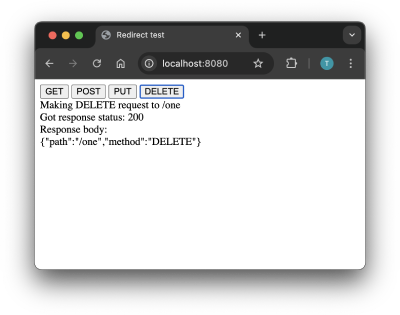

# Redirect Test

This project demonstrates how `302` and `307` redirects function.

1. Run the server

```bash
python3 server.py
```

2. Open your browser and navigate to http://localhost:8080/.
3. Use the buttons on the page to send requests with different HTTP methods (`GET`, `POST`...) and observe the server's responses.



The server defines the following endpoints:

* `/one` redirects to `/two` with a `307` status code
* `/two` redirects to `/three` with a `307` status code
* `/three` redirects to `/four` with a `307` status code
* `/four` redirects to `/echo`  with a `307` status code

The final destination, `/echo` returns the request data to the browser.

The server prints out all incoming requests into console, including their bodies.

```
Starting server on ('localhost', 8080)
>>> Request:
GET /


<<< Response:
200 OK

>>> Request:
DELETE /one
{"path":"/one","method":"DELETE"}

<<< Response:
307 Temporary Redirect
Location: /two

>>> Request:
DELETE /two
{"path":"/one","method":"DELETE"}

<<< Response:
307 Temporary Redirect
Location: /three

>>> Request:
DELETE /three
{"path":"/one","method":"DELETE"}

<<< Response:
307 Temporary Redirect
Location: /four

>>> Request:
DELETE /four
{"path":"/one","method":"DELETE"}

<<< Response:
307 Temporary Redirect
Location: /echo

>>> Request:
DELETE /echo
{"path":"/one","method":"DELETE"}

<<< Response:
200 OK
{"path":"/one","method":"DELETE"}
```

Note how the browser sends the body every time it follows a redirect.

4. Modify `server.py` to change some of the redirect status codes in the redirect chain from `307` to `302` and observe how the browser behavior changes.

```diff
-        "/three": Redirect("/four", 307),
+        "/three": Redirect("/four", 302),
```

Here is how the browser behaves to `302` when using `POST` request:

```
>>> Request:
POST /one
{"path":"/one","method":"POST"}

<<< Response:
307 Temporary Redirect
Location: /two

>>> Request:
POST /two
{"path":"/one","method":"POST"}

<<< Response:
307 Temporary Redirect
Location: /three

>>> Request:
POST /three
{"path":"/one","method":"POST"}

<<< Response:
302 Found
Location: /four

>>> Request:
GET /four


<<< Response:
307 Temporary Redirect
Location: /echo

>>> Request:
GET /echo


<<< Response:
200 OK
```

Note that the `POST` changes to `GET` after the `302` redirect and the body is lost, since `GET` requests do not generally have a body.
